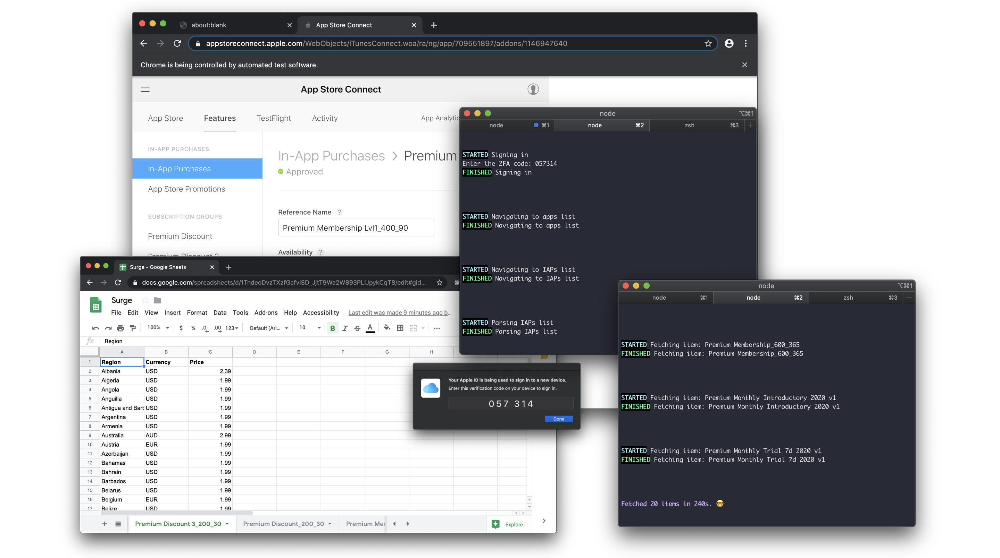

# App Store SKU Editor



## Usage

### Setting local environment

First, you need to create a `.env` file in the root of the project, with the following:

```sh
# App Store

APP_STORE_CONNECT_EMAIL=<your email>
APP_STORE_CONNECT_PASSWORD=<your password>

APP_STORE_CONNECT_APP_ID=<ID for desired app>

# Google Sheets

GOOGLE_SPREADSHEET_ID=<ID of the Google Sheet to be populated with data>
```

Also, you will need a `credentials.json` file which enables our _Service Account_ (a specific _bot_ user generated by Google for this application).

Ideally, you can ask the project maintainer for both `.env` and `credentials.json` files. In case you don't have a `credentials.json` file, head to [Google Sheets Authentication](#authentication) section.

### Starting

- Run `yarn` or `npm install`
- Run `yarn build`
- Run `yarn start`
- Follow prompts on the screen

## Development

### Running

- Run `yarn` or `npm install`
- Run `yarn watch` to start development mode

### Google Sheets

#### Authentication

The V4 Google Sheets API requires some level of authentication to make any requests. This app connects as a specific "bot" user generated by Google for your application.

##### Setting up your Google project

1. Go to the [Google Developers Console](https://console.developers.google.com/)
1. Select your project or create a new one (and then select it)
1. Enable the Sheets API for your project
   - In the sidebar on the left, select **APIs & Services > Library**
   - Search for "sheets"
   - Click on "Google Sheets API"
   - click the blue "Enable" button

##### Setting up your Service Account

1. Create a service account for your project
   - In the sidebar on the left, select **APIs & Services > Credentials**
   - Click blue "+ CREATE CREDENTIALS" and select "Service account" option
   - Enter name, description, click "CREATE"
   - You can skip permissions, click "CONTINUE"
   - Click "+ CREATE KEY" button
   - Select the "JSON" key type option
   - Click the "Create" button
   - your JSON key file is generated and downloaded to your machine (**it is the only copy!**)
   - Click "DONE"
   - note your service account's email address (also available in the JSON key file)
1. Share the doc (or docs) with your service account using the email noted above
